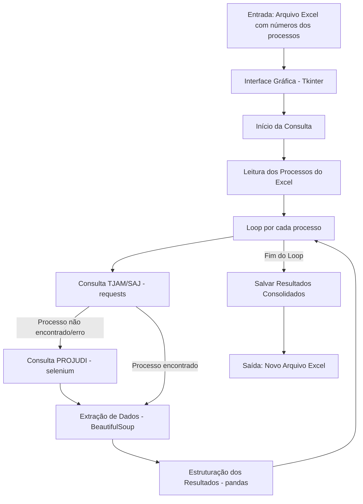

# RPA de Consulta Processual TJAM (SAJ e PROJUDI)

## 1. Descrição Geral

Este projeto consiste em uma aplicação de Automação de Processos Robóticos (RPA) desenvolvida em Python para consultar a última movimentação de processos judiciais nos portais do Tribunal de Justiça do Amazonas (TJAM). A aplicação é capaz de buscar informações tanto no sistema antigo (SAJ - Sistema de Automação da Justiça) quanto no sistema mais recente (PROJUDI).

O sistema possui uma interface gráfica amigável construída com Tkinter, permitindo que o usuário carregue uma lista de números de processos a partir de um arquivo Excel, execute as consultas de forma automatizada e salve os resultados em uma nova planilha Excel.

## 2. Regra de Negócio Principal

A principal regra de negócio é automatizar a obtenção da **data e descrição da última movimentação** de uma lista de processos judiciais. A consulta é realizada da seguinte forma:

1.  **Consulta Inicial no Portal SAJ (TJAM):** Para cada número de processo, o sistema primeiro tenta obter a última movimentação no portal SAJ do TJAM.
2.  **Fallback para o PROJUDI:**
    *   Se o processo no SAJ indicar explicitamente que foi **transferido para o PROJUDI**.
    *   Se o processo no SAJ **não for encontrado** ou **não apresentar movimentações**.
    *   Em caso de **erros de conexão ou processamento** ao consultar o SAJ.
    Nesses casos, o sistema automaticamente tenta consultar o mesmo número de processo no portal PROJUDI.
3.  **Consulta no PROJUDI (via Selenium):**
    *   Requer credenciais de acesso (usuário e senha), que podem ser salvas localmente de forma segura através da interface da aplicação.
    *   Utiliza Selenium para automatizar a navegação no navegador (Google Chrome em modo headless), realizar o login, navegar pelos menus e buscar o processo.
    *   Extrai a data e a descrição da última movimentação.
    *   Identifica processos marcados como "Segredo de Justiça", retornando essa informação.
4.  **Consolidação e Saída:** Os resultados (data e descrição da última movimentação, ou indicações de erro/segredo de justiça) são coletados para todos os processos e podem ser salvos em um novo arquivo Excel.

### Fluxograma do Processo



## 3. Funcionalidades

*   **Interface Gráfica (GUI):** Construída com Tkinter para facilitar a interação do usuário.
*   **Carregamento de Processos em Lote:** Permite carregar uma lista de números de processos a partir de um arquivo Excel (`.xlsx` ou `.xls`). O arquivo deve conter uma coluna chamada "PROCESSO" ou "processo".
*   **Consulta Automatizada:** Realiza o web scraping nos portais SAJ e PROJUDI.
*   **Gerenciamento de Credenciais PROJUDI:**
    *   Permite ao usuário salvar suas credenciais do PROJUDI através da interface.
    *   **Melhoria de Segurança:** As credenciais agora são preferencialmente armazenadas de forma segura usando o serviço `keyring` do sistema operacional. Caso o `keyring` não esteja disponível ou configurado, elas serão salvas no arquivo `config.ini` (com um aviso de segurança).
    *   As credenciais salvas são carregadas automaticamente ao iniciar a aplicação, tentando primeiro o `keyring`.
*   **Tratamento de Casos Específicos:**
    *   Processos transferidos do SAJ para o PROJUDI.
    *   Processos em "Segredo de Justiça" no PROJUDI.
    *   Processos não encontrados ou sem movimentações.
    *   **Nova Regra de Status:** Se a consulta no SAJ (TJAM) não retornar informações e a consulta subsequente no PROJUDI resultar em "Nenhum registro encontrado" ou se o processo não for listado após a busca no PROJUDI (e não for "Segredo de Justiça"), a descrição final para o processo será "Processo possivelmente com numero errado ou necessita de senha de acesso SAJ".
*   **Feedback em Tempo Real (Logging):** O progresso da consulta e logs detalhados agora são exibidos em uma área de log na interface, utilizando o módulo `logging` padrão do Python, o que melhora a rastreabilidade e o desacoplamento.
*   **Salvar Resultados:** Permite salvar os resultados consolidados (Número do Processo, Data da Última Movimentação, Descrição da Última Movimentação) em um novo arquivo Excel.
*   **Modularidade Aprimorada:** O código foi refatorado para maior desacoplamento entre módulos (UI, lógica de negócio, scraping, utilitários) e centralização de constantes em `utils/constants.py`, melhorando a manutenibilidade e escalabilidade.


## 4. Estrutura do Projeto

O projeto está organizado da seguinte forma:

```
TJAM-PROJUDI-consulta/
├── main.py                 # Ponto de entrada principal da aplicação, orquestra UI e lógica.
├── ui/
│   └── interface.py        # Contém a classe AppUI e toda a lógica da interface gráfica (Tkinter).
├── core/
│   ├── tjam_scraper.py     # Lógica de scraping para o portal SAJ do TJAM.
│   ├── projudi_orchestrator.py # Orquestra a consulta PROJUDI utilizando Page Objects.
│   └── projudi_pages.py    # Implementa o padrão Page Object Model para interações com o PROJUDI.
├── utils/
│   ├── config_manager.py   # Gerencia o carregamento e salvamento de credenciais (prioriza `keyring`, fallback para `config.ini`).
│   ├── excel_handler.py    # Lida com a leitura e escrita de arquivos Excel.
│   └── constants.py        # Novo módulo que centraliza strings e constantes para maior legibilidade e manutenção.
├── config.ini              # (Opcional) Arquivo para armazenar as credenciais do PROJUDI (agora um fallback para `keyring`).
├── requirements.txt        # Lista de dependências Python do projeto.
└── README.md               # Este arquivo.
```

## 5. Pré-requisitos

*   **Python 3.x** (recomendado 3.7 ou superior).
*   **Google Chrome** instalado no sistema (necessário para a consulta ao PROJUDI via Selenium).
*   Acesso à Internet.

## 6. Instalação e Configuração

1.  **Obtenha os arquivos do projeto:**
    *   Se for um repositório Git: `git clone <url_do_repositorio>`
    *   Ou baixe e extraia os arquivos para um diretório de sua escolha.

2.  **Crie e Ative um Ambiente Virtual (Recomendado):**
    ```bash
    python -m venv venv
    # No Windows (PowerShell):
    .\venv\Scripts\activate
    # No Linux/macOS:
    source venv/bin/activate
    ```

3.  **Instale as Dependências:**
    Navegue até o diretório raiz do projeto (onde `requirements.txt` está localizado) e execute:
    ```bash
    pip install -r requirements.txt
    ```
    Isso instalará todas as bibliotecas necessárias, incluindo `keyring` (nova dependência), `requests`, `beautifulsoup4`, `pandas`, `selenium`, `webdriver-manager`, e `openpyxl`.

4.  **Credenciais do PROJUDI (Via Interface):**
    *   As credenciais **devem ser inseridas e salvas pela primeira vez através da interface gráfica da aplicação**. Elas serão armazenadas de forma segura (via `keyring`) ou, como fallback, em `config.ini`. **Não é mais recomendado criar `config.ini` manualmente com senhas em texto plano.**

## 7. Como Usar

1.  **Execute a Aplicação:**
    Certifique-se de que seu ambiente virtual (se estiver usando um) está ativado. Navegue até o diretório raiz do projeto e execute:
    ```bash
    python main.py
    ```

2.  **Carregue o Arquivo Excel:**
    *   Clique no botão "**Carregar Processos**".
    *   Selecione o arquivo Excel (`.xlsx` ou `.xls`) que contém os números dos processos.
    *   O arquivo deve ter uma coluna chamada "**PROCESSO**" (ou "**processo**") com os números dos processos a serem consultados.

3.  **Credenciais do PROJUDI (Se necessário):**
    *   Se você ainda não salvou suas credenciais do PROJUDI, insira seu nome de usuário e senha nos campos apropriados na seção "Credenciais PROJUDI".
    *   Clique em "**Salvar Credenciais**". Uma mensagem ou log confirmará o salvamento.

4.  **Inicie a Consulta:**
    *   Após carregar o arquivo Excel e (se necessário) configurar as credenciais, o botão "**Iniciar Consulta**" será habilitado.
    *   Clique em "**Iniciar Consulta**".
    *   A aplicação começará a processar cada número de processo. O progresso e os logs detalhados serão exibidos na área de status da interface.

5.  **Salve os Resultados:**
    *   Ao final da consulta de todos os processos, uma caixa de diálogo aparecerá automaticamente, solicitando que você escolha um local e nome para salvar o arquivo Excel com os resultados.
    *   O arquivo de saída conterá as colunas: `PROCESSO`, `DATA_ULTIMA_MOVIMENTACAO`, `DESCRICAO_ULTIMA_MOVIMENTACAO`, `REQUERIDO/EXECUTADO`.

6.  **Nova Consulta:**
    *   Para realizar uma nova consulta com um arquivo diferente, clique no botão "**Nova Consulta**". Isso resetará a interface.

## 8. Detalhes Técnicos

*   **Interface Gráfica:** Tkinter (biblioteca padrão do Python).
*   **Consulta SAJ (TJAM):** Realizada com as bibliotecas `requests` (para requisições HTTP) e `BeautifulSoup4` (para parsing de HTML).
*   **Consulta PROJUDI:** Refatorada para utilizar o padrão Page Object Model para maior modularidade. Realizada com `Selenium` (para automação de navegador) e `webdriver-manager` (para gerenciamento automático do ChromeDriver). O Google Chrome é controlado em modo headless (sem interface visível).
*   **Manipulação de Excel:** Realizada com a biblioteca `Pandas`.
*   **Gerenciamento de Credenciais:** Agora utiliza a biblioteca `keyring` para armazenamento seguro no sistema operacional, com `configparser` como um fallback menos seguro.
*   **Sistema de Logging:** Implementado um sistema de logging robusto com o módulo `logging` do Python, exibindo feedback detalhado na interface do usuário (UI).
*   **Modularidade Aprimorada:** O código foi refatorado para maior desacoplamento entre módulos (UI, lógica de negócio, scraping, utilitários) e centralização de constantes em `utils/constants.py`, melhorando a manutenibilidade e escalabilidade.
*   **Threading:** As operações de carregamento de arquivo e consulta principal são executadas em threads separadas para manter a interface gráfica responsiva.

## 9. Observações e Limitações

*   **Fragilidade do Web Scraping:** A automação depende da estrutura atual dos portais SAJ e PROJUDI. Mudanças no layout ou HTML desses sites podem quebrar a funcionalidade de scraping, exigindo atualizações no código.
*   **ChromeDriver:** O `webdriver-manager` tenta manter o ChromeDriver compatível com a versão instalada do Google Chrome. No entanto, em raras ocasiões, podem ocorrer incompatibilidades que exigem intervenção manual ou atualização do `webdriver-manager`.
*   **Segurança das Credenciais (Refinada):** Embora o uso de `keyring` aumente significativamente a segurança das credenciais, é fundamental que o usuário esteja ciente de que, se o `keyring` não estiver operacional em seu ambiente, as credenciais podem ser salvas em `config.ini` (texto plano). Para ambientes compartilhados ou de alta segurança, a verificação da operacionalidade do `keyring` e a não-persistência em `config.ini` podem ser desejáveis.
*   **Captcha e Mecanismos Anti-Robô:** Atualmente, os portais não implementam (ou não de forma impeditiva para este script) mecanismos complexos de captcha para as consultas realizadas. Se isso mudar, a automação pode ser significativamente dificultada.
*   **Volume de Consultas:** Consultas excessivas em um curto período podem levar a bloqueios temporários de IP pelos portais. O script não implementa, por padrão, controle de taxa de requisições sofisticado.

---

Este README visa fornecer uma visão completa do projeto, desde sua funcionalidade até os detalhes de implementação e uso.

## 10. Criando um Executável

É possível criar um arquivo executável independente para esta aplicação usando a ferramenta PyInstaller. Isso permite que a aplicação seja executada em máquinas Windows sem a necessidade de ter o Python ou as dependências instaladas (exceto o Google Chrome, que ainda é um pré-requisito para a funcionalidade do PROJUDI).

1.  **Instale o PyInstaller:**
    Se você seguiu os passos de instalação e instalou as dependências de `requirements.txt`, o PyInstaller já deve estar instalado. Caso contrário, instale-o no seu ambiente virtual:
    ```bash
    pip install pyinstaller
    ```

2.  **Gere o Executável:**
    No terminal, na raiz do projeto (onde `main.py` está localizado), execute o seguinte comando:
    ```bash
    pyinstaller --onefile --windowed --name TJAM_PROJUDI_Consulta main.py
    ```
    *   `--onefile`: Cria um único arquivo executável.
    *   `--windowed`: Suprime a janela do console ao executar a aplicação gráfica.
    *   `--name TJAM_PROJUDI_Consulta`: Define o nome do arquivo executável (ex: `TJAM_PROJUDI_Consulta.exe`).
    *   `main.py`: O script de entrada da aplicação.

3.  **Localize o Executável:**
    Após a conclusão do processo, o PyInstaller criará uma pasta chamada `dist` no diretório do seu projeto. O executável (`TJAM_PROJUDI_Consulta.exe`) estará dentro desta pasta `dist`.

4.  **Observações sobre o Executável:**
    *   O arquivo `config.ini` (se existir ou for criado pela aplicação) será lido/gravado no mesmo diretório onde o executável for executado.
    *   O Google Chrome ainda precisa estar instalado na máquina do usuário final.
    *   O `webdriver-manager` (usado pelo Selenium) tentará baixar o ChromeDriver apropriado em tempo de execução, o que requer acesso à internet na primeira vez ou para atualizações do driver.
    *   Para o gerenciamento seguro de credenciais via `keyring`, pode ser necessária alguma configuração inicial dependendo do sistema operacional. Consulte a documentação do `keyring` para detalhes.
