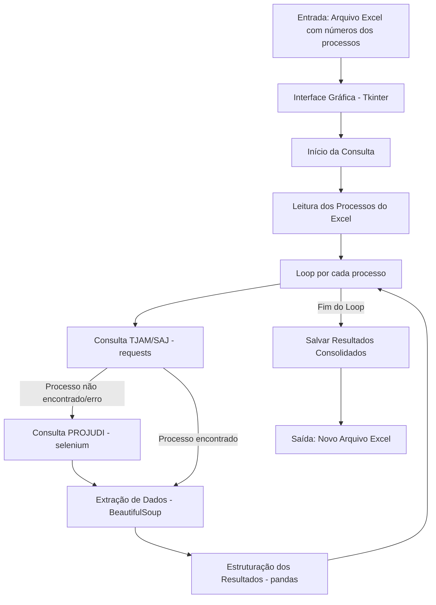

# Relatório Técnico do Projeto de Consulta Processual

Este documento detalha a estrutura, o propósito e as implicações do projeto de automação de consulta processual nos portais do TJAM (SAJ) e PROJUDI.

## 1. Problema & Importância

A consulta manual de múltiplos processos judiciais em portais governamentais é uma tarefa repetitiva, demorada e suscetível a erros. Advogados, escritórios de advocacia e outros profissionais da área jurídica frequentemente precisam verificar o andamento de dezenas ou centenas de casos diariamente.

Este projeto ataca diretamente essa ineficiência. A automação da consulta processual libera os profissionais para se concentrarem em atividades de maior valor, aumenta a precisão dos dados coletados e permite um acompanhamento quase em tempo real do andamento dos processos. A importância reside na otimização de recursos, redução de custos operacionais e na capacidade de gerenciar um grande volume de informações de forma eficaz.

## 2. Arquitetura do Pipeline

O sistema foi arquitetado seguindo um pipeline claro de processamento de dados, dividido em três fases principais: Extração, Engenharia e Análise/Apresentação.

-   **Extração:**
    -   **Fonte 1 (TJAM/SAJ):** Utiliza a biblioteca `requests` para fazer requisições HTTP diretas ao portal, obtendo o HTML da página de processos. Esta abordagem é rápida e eficiente para sites que não dependem de JavaScript para renderizar o conteúdo principal.
    -   **Fonte 2 (PROJUDI):** Refatorada para utilizar o padrão Page Object Model, dividindo a responsabilidade de interação com cada tela do PROJUDI em classes específicas (`core/projudi_pages.py`). A orquestração da consulta fica a cargo de `core/projudi_orchestrator.py`. Utiliza a biblioteca `selenium` com `webdriver-manager` para automatizar um navegador Chrome em modo headless. Esta abordagem é necessária para o PROJUDI, pois o portal exige login e navegação complexa baseada em JavaScript e iframes para acessar as informações. Foram implementadas pausas estratégicas (`time.sleep` através de constantes em `utils/constants.py`) para simular o comportamento humano e mitigar riscos de bloqueio.

-   **Engenharia:**
    -   **Parsing:** Após a extração do HTML, a biblioteca `BeautifulSoup4` é usada para analisar (parse) o documento, permitindo a navegação e a extração de dados específicos, como a data e a descrição da última movimentação, além do nome da parte requerida/executada.
    -   **Limpeza e Estruturação:** Os dados extraídos são limpos (remoção de espaços extras, quebras de linha) e estruturados em um formato consistente. A biblioteca `pandas` é utilizada para organizar os resultados em memória antes de serem salvos. Para maior organização e manutenibilidade, strings e valores chave agora são centralizados em `utils/constants.py`. Os dados do requerido/executado são convertidos para maiúsculas no arquivo Excel final.

-   **Análise e Apresentação:**
    -   **Interface do Usuário:** Uma interface gráfica construída com `tkinter` serve como a principal forma de interação do usuário. Ela permite carregar uma lista de processos de um arquivo Excel, inserir credenciais, iniciar a consulta.
    -   **Sistema de Logging (Feedback em Tempo Real):** O módulo `logging` do Python foi integrado para fornecer feedback detalhado do progresso e eventuais erros diretamente na interface do usuário, desacoplando a lógica de negócio da apresentação de mensagens.

Abaixo, um fluxograma que representa visualmente o pipeline de dados da aplicação:

## 3. Principais Descobertas (Gráficos/Insights)

Embora a ferramenta atual não gere gráficos diretamente, os dados estruturados salvos em Excel abrem um vasto potencial para análise e geração de insights, como:

-   **Análise de Tempo:** É possível calcular o tempo médio entre as movimentações processuais, identificando gargalos ou períodos de inatividade nos processos.
-   **Categorização de Movimentações:** Analisar a frequência dos tipos de movimentação (ex: "Conclusos para Despacho", "Juntada de Petição") pode revelar padrões sobre o andamento dos casos.
-   **Monitoramento de Status:** A criação de dashboards (utilizando Excel, Power BI ou outras ferramentas) a partir dos dados exportados pode oferecer uma visão gerencial do status de todos os processos de um escritório, destacando casos que exigem atenção imediata.

## 4. Reflexões Éticas e Legais

A automação da coleta de dados em portais públicos exige uma análise cuidadosa das implicações éticas e legais.

-   **LGPD (Lei Geral de Proteção de Dados - Lei nº 13.709/2018):** A coleta e o tratamento de dados processuais, mesmo que de acesso público, devem estar em conformidade com a LGPD.
    -   **Base Legal para Tratamento:** O tratamento de dados realizado por esta ferramenta pode ser enquadrado no **Art. 7º, Inciso II**, que permite o tratamento de dados para o "cumprimento de obrigação legal ou regulatória pelo controlador". Advogados e partes de um processo têm a obrigação legal de acompanhar o andamento processual. Adicionalmente, o **Inciso V** pode ser aplicável para a "execução de contrato ou de procedimentos preliminares relacionados a contrato do qual seja parte o titular, a pedido do titular dos dados".
    -   **Princípio da Finalidade (Art. 6º, I):** O uso dos dados coletados deve se limitar estritamente à finalidade informada, que é o acompanhamento do andamento processual. É vedado o uso desses dados para qualquer outra finalidade sem o consentimento do titular ou outra base legal.
    -   **Princípio da Necessidade (Art. 6º, III):** A ferramenta deve coletar apenas os dados estritamente necessários para a finalidade proposta (ex: última movimentação), evitando a coleta excessiva de informações pessoais.
    -   **Segurança dos Dados (Art. 46):** Os resultados das consultas são salvos em um arquivo Excel que contém dados processuais. A responsabilidade do usuário é garantir a segurança do ambiente onde a ferramenta é executada para prevenir acessos não autorizados. As credenciais de acesso ao PROJUDI agora são armazenadas de forma segura utilizando o `keyring` do sistema operacional (preferencialmente), e apenas como fallback no `config.ini` em texto plano.
    -   **Dados Sensíveis:** Processos em "Segredo de Justiça" podem conter dados sensíveis. A ferramenta identifica esses casos e limita a extração, alinhando-se ao princípio de tratamento diferenciado para dados sensíveis.

-   **5. Melhorias Implementadas e Boas Práticas:**
    Este projeto passou por um processo de refatoração significativo para aprimorar sua arquitetura, legibilidade e manutenibilidade, resultando em um código mais robusto e fácil de estender no futuro. As principais melhorias incluem:
    -   **Sistema de Logging Centralizado:** Integração do módulo `logging` do Python, permitindo um registro mais eficiente e detalhado de eventos, progresso e erros. A interface do usuário agora exibe logs de forma desacoplada da lógica de negócio.
    -   **Uso de Constantes:** Criação do arquivo `utils/constants.py` para centralizar todas as strings literais e valores fixos (como nomes de colunas, mensagens de erro e tempos de espera). Isso elimina "magic strings", facilita atualizações e melhora a legibilidade do código.
    -   **Armazenamento Seguro de Credenciais:** Implementação do `keyring` para proteger as credenciais de acesso ao PROJUDI. O `keyring` utiliza os mecanismos de armazenamento seguro do sistema operacional, adicionando uma camada crucial de segurança em comparação ao armazenamento em texto plano.
    -   **Modularização e Desacoplamento:** A separação de responsabilidades entre os módulos (`ui`, `core`, `utils`) foi reforçada. A UI se comunica com a lógica de negócio por meio de callbacks e o logging, reduzindo o acoplamento direto e tornando os componentes mais independentes e reutilizáveis.
    -   **Refatoração da Lógica de Fallback:** A condicional para alternar do SAJ para o PROJUDI no `tjam_scraper.py` foi unificada e otimizada para maior clareza e robustez.
-   **Direitos Autorais e Termos de Serviço:** Os portais governamentais possuem termos de serviço que devem ser respeitados. A automação não deve sobrecarregar os servidores do tribunal, e a ferramenta deve ser utilizada de forma consciente. O uso de pausas (`time.sleep` através de constantes) e a execução em modo headless ajudam a mitigar o impacto, mas o uso responsável é primordial.
-   **robots.txt:** O arquivo `robots.txt` é um padrão da web que indica quais partes de um site os robôs de automação podem ou não acessar. Embora a ferramenta não verifique este arquivo atualmente, uma boa prática de web scraping ético é sempre respeitar as diretrizes contidas nele para evitar o acesso a áreas restritas e manter uma boa relação com os administradores do portal.
